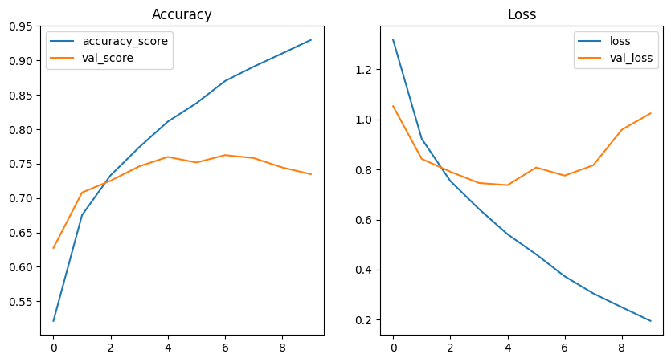
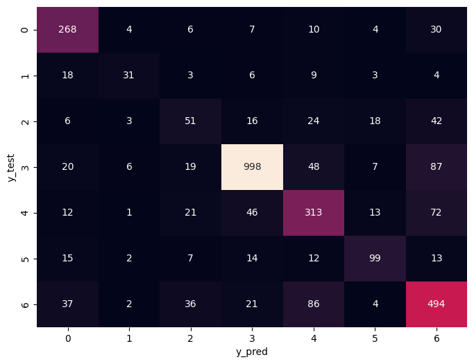
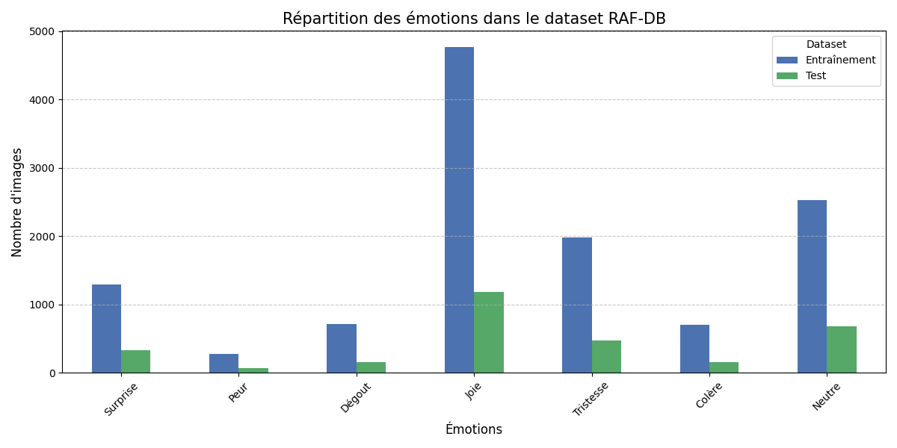

# Reconnaissance d'émotions faciales — RAF-DB

Système de reconnaissance d'émotions faciales entraîné sur le dataset **RAF-DB** (Real-world Affective Faces Database). Le modèle classifie 7 émotions à partir d'images de visages via du **transfer learning VGG16**, exposé par une **API REST FastAPI** et consommable via deux interfaces : une page web vanilla JS et un chatbot Streamlit interactif.

---

## Émotions reconnues

| Label | Émotion   | Emoji |
|-------|-----------|-------|
| 1     | Surprise  | 😮    |
| 2     | Peur      | 😨    |
| 3     | Dégoût    | 🤢    |
| 4     | Joie      | 😄    |
| 5     | Tristesse | 😢    |
| 6     | Colère    | 😠    |
| 7     | Neutre    | 😐    |

---

## Résultats

- **Précision globale (weighted) : ~82.4%**
- Joie : F1 = 0.93 (classe majoritaire — 1 185 samples test)
- Dégoût : F1 = 0.41 (classe minoritaire — 74 samples test)

### Courbes d'entraînement



### Matrice de confusion



### Distribution des émotions



---

## Architecture du modèle

```
VGG16 (ImageNet, toutes les couches dégelées)
    └── Flatten
    └── Dense(512, relu) + BatchNormalization
    └── Dropout(0.5)
    └── Dense(7, softmax)
```

- **Input :** images RGB 100×100
- **Optimizer :** Adam (lr=1e-4)
- **Loss :** sparse_categorical_crossentropy
- **Callbacks :** EarlyStopping (patience=8), ReduceLROnPlateau

---

## Structure du projet

```
raf-db/
├── app_fastapi.py        # API FastAPI principale (inference)
├── app.py                # API Flask alternative
├── streamlit_app.py      # Chatbot Streamlit (caméra + upload fichier)
├── index.html            # Frontend vanilla JS
│
├── models/
│   └── model_raf.h5      # Modèle entraîné (196 MB, Git LFS)
│
├── notebooks/
│   ├── raf transfert VGG16.ipynb   # Entraînement principal (meilleurs résultats)
│   ├── raf transfert.ipynb
│   ├── raf simple.ipynb
│   ├── raf augmentation.ipynb
│   └── raf poid.ipynb
│
├── results/              # Graphiques et matrices de confusion
├── samples/              # Images de test (démo)
├── test/
│   └── testgpu.py        # Vérification GPU TensorFlow
└── DATASET/              # RAF-DB (bind-mount, non versionné)
    ├── train/            # 12 271 images, sous-dossiers 1–7
    └── test/             # 3 068 images, sous-dossiers 1–7
```

---

## Démarrage rapide

### 1. Prérequis

- Docker + [NVIDIA Container Toolkit](https://docs.nvidia.com/datacenter/cloud-native/container-toolkit/install-guide.html)
- VS Code avec l'extension **Dev Containers**
- Dataset RAF-DB placé dans `c:/ProjetIA/raf-db/DATASET`

### 2. Ouvrir dans le devcontainer

```bash
# Cloner le dépôt
git clone <url-du-repo>
cd raf-db

# VS Code : "Reopen in Container"
# L'image nvcr.io/nvidia/tensorflow:25.02-tf2-py3 sera utilisée (GPU activé)
```

### 3. Lancer l'API

```bash
python app_fastapi.py
# API disponible sur http://localhost:5000
```

### 4. Interface web (vanilla JS)

Ouvrir `index.html` directement dans le navigateur (l'API doit tourner).

### 5. Chatbot Streamlit

```bash
pip install streamlit requests
streamlit run streamlit_app.py
# Disponible sur http://localhost:8501
```

Le chatbot propose deux modes d'entrée au démarrage :
- **📷 Caméra** — prise de photo en direct
- **📁 Fichier** — chargement d'une image depuis le PC (JPG, PNG, WEBP)

Après chaque analyse, des boutons **Continuer** (même mode) et **Changer de mode** sont affichés sous le résultat.

---

## API REST

### `POST /predict`

Envoie une image et reçoit les émotions détectées.

**Request :** `multipart/form-data` avec un champ `file` (image JPEG/PNG)

**Response :**
```json
{
  "faces_detected": 2,
  "predictions": [
    {
      "emotion": "Joie",
      "confidence": 91.3,
      "box": { "x": 120, "y": 45, "w": 80, "h": 80 }
    },
    {
      "emotion": "Neutre",
      "confidence": 78.5,
      "box": { "x": 300, "y": 60, "w": 75, "h": 75 }
    }
  ]
}
```

**Exemple curl :**
```bash
curl -X POST http://localhost:5000/predict \
  -F "file=@photo.jpg"
```

### `GET /test`

```json
{ "status": "ok" }
```

---

## Pipeline d'inférence

1. Décodage de l'image uploadée
2. Détection des visages via **Haar Cascade OpenCV** (`detectMultiScale(gray, 1.1, 5)`)
3. Redimensionnement de chaque visage en 100×100 + normalisation VGG16
4. Inférence batch (un seul appel `model.predict()`)
5. Retour de l'émotion + confiance + coordonnées pour chaque visage

---

## Environnement technique

| Composant      | Version                              |
|----------------|--------------------------------------|
| Image Docker   | `nvcr.io/nvidia/tensorflow:25.02-tf2-py3` |
| Python         | 3.x                                  |
| TensorFlow     | 2.x (GPU)                            |
| NumPy          | < 2.0.0 (1.26.4)                     |
| SciPy          | < 1.13.0                             |
| OpenCV         | < 4.10 (headless)                    |
| FastAPI        | latest                               |
| Streamlit      | latest                               |

---

## Dataset

**RAF-DB** (Real-world Affective Faces Database) — dataset public de visages annotés en conditions réelles.

- Train : 12 271 images
- Test : 3 068 images
- 7 classes avec déséquilibre significatif (Joie×16 vs Peur)

> Le dataset n'est pas inclus dans ce dépôt. Il doit être placé dans `DATASET/` (bind-mount devcontainer).
